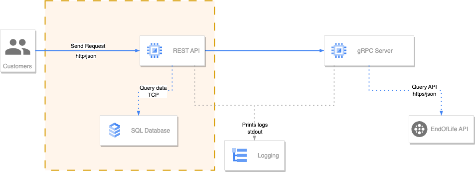

# End of life Server

**Author:Rafael Chavez Solis**

***Email:rafaelchavezsolis@gmail.com***

## Description

Contains the endoflife client application to send requests concurrently and store data into database.

Expose and REST API using Gin Framework and consumes the [EndOfLife Server Example](https://github.com/rcsolis/endoflife_server)

## Architecture

This repository contains the componets highlighting in orange.



The logging ilustrates the use of standard log output using the *log standard package*.

### Database

Use mongodb as database to test persistend data of cycle details.

### gRPC

Command to build:
```bash
protoc --proto_path=./ \
--go_out=./ \
--go_opt=paths=source_relative \
--go-grpc_out=./ \
--go-grpc_opt=paths=source_relative,require_unimplemented_servers=false \
./internal/proto/*.proto
```

## Stack:
- Go 1.23.4
- ProtocolBufers 3 (proto3)
- google.golang.org/grpc
- google.golang.org/grpc/codes
- google.golang.org/grpc/status
- Gin